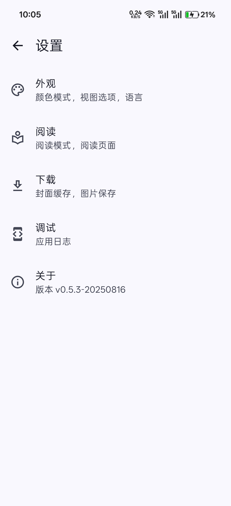
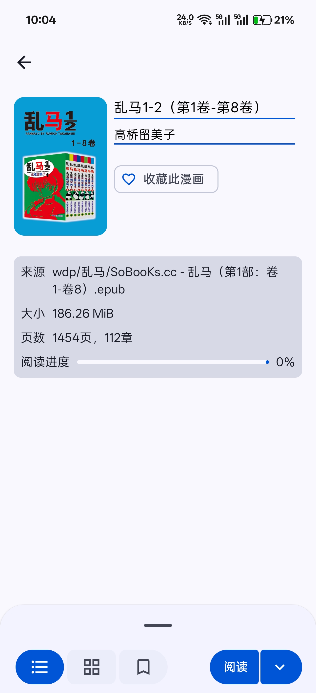
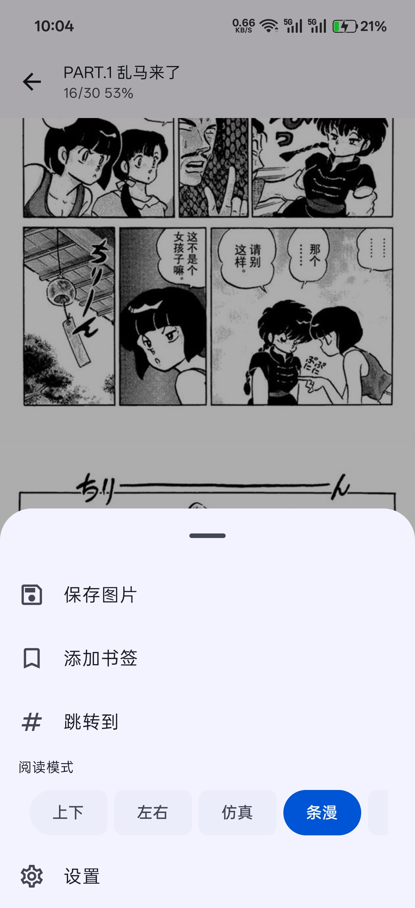

# MangaReader 漫画阅读器

简洁、高性能、Compose、Material Design3 的本地漫画阅读器

## 🖼️ Screenshots

## 特性
- 支持多种格式（epub、mobi、azw3、pdf）导入、Wifi传输
- 高性能，采用native解析文件
- 简洁，体积小
- Compose + Material Design3 开发设计
- 支持多种翻页，水平、左右、仿真翻页、Tinder、条漫
- 阅读记录
- 动态主题

## 下载
- 在release页面下载